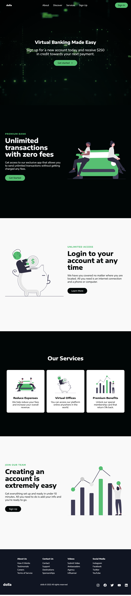
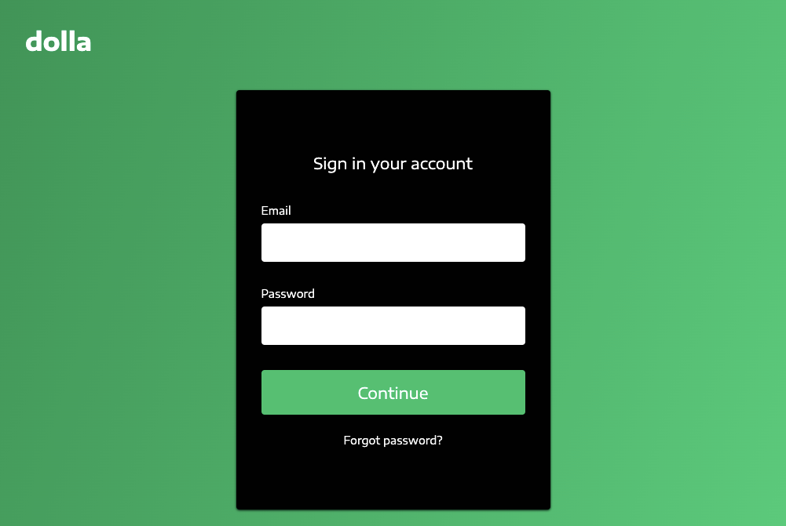

# Marketing Landing Page

Marketing Landing Page is a standalong react web page, created specifically for marketing/advertising campaign for a bank. The purpose is to capture info from contacts in exchange for something of value (No data is being stored/misused).

## Links

- [Live Demo](https://marketing-campaign-landing-page.netlify.app/)

## Screenshots

### Home Page:

### Sign In:

Allows user to sign into their banking account (form does not submit actual data).

## Technology

### Built with:

- React, including useState and useEffect, react-scroll, and styled-components

  - Created with [create-react-app](https://github.com/facebook/create-react-app)

## Illustrations

- UnDraw SVGS [unDraw.co](https://undraw.co/)
